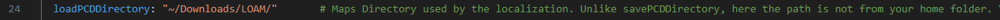
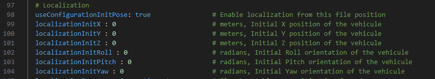
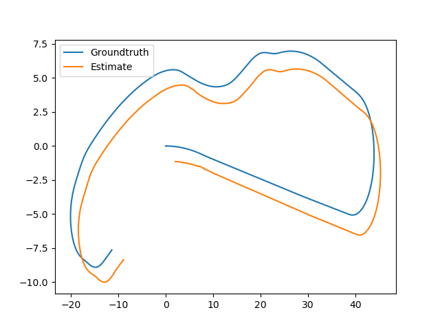
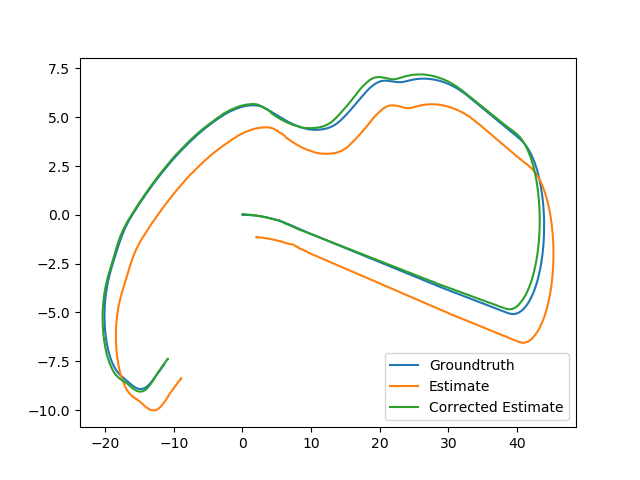
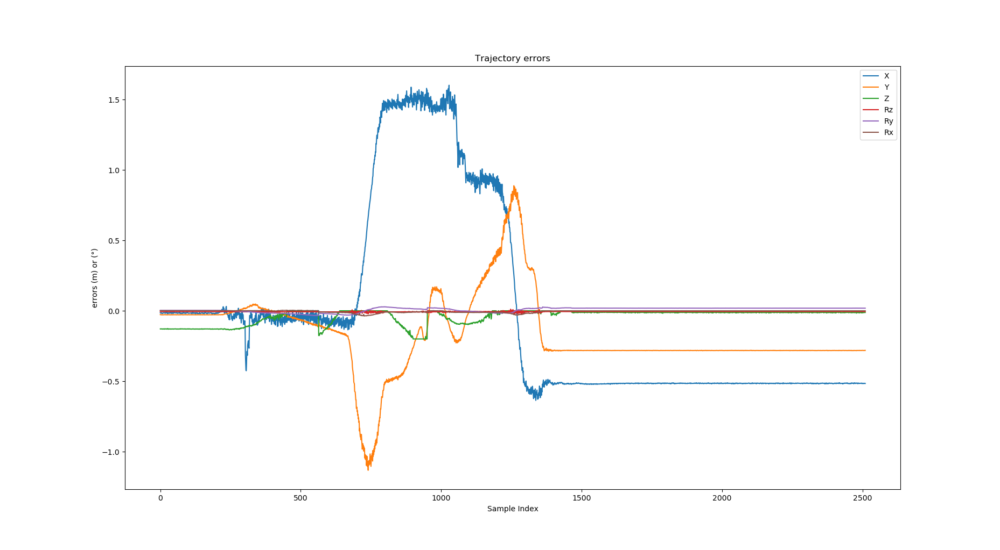
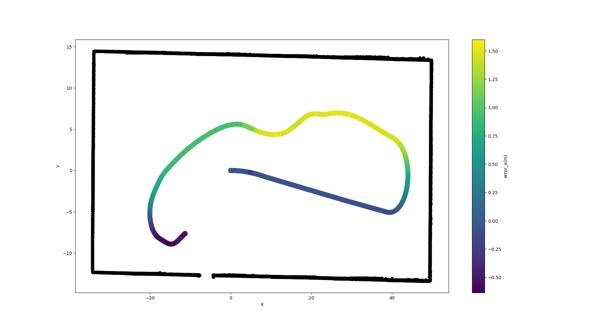
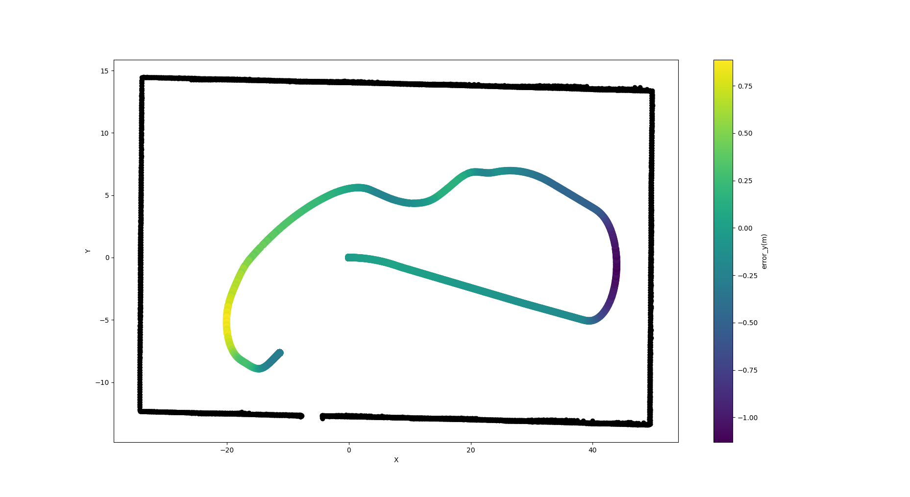
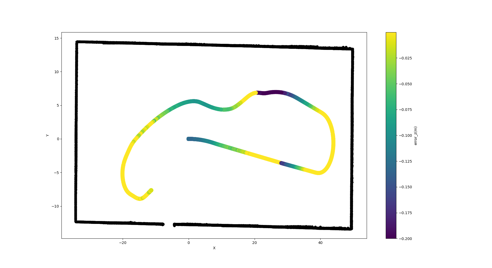

# LIO-SAM

[LIO-SAM](https://github.com/TixiaoShan/LIO-SAM): Tightly-coupled Lidar Inertial Odometry via Smoothing and Mapping.

LIO-SAM is a framework designed to accomplish precise and real-time trajectory estimation and map-building for mobile robots. It employs a factor graph approach, integrating lidar-inertial odometry.


## Docker installation

### Build
```bash
docker build -t docker_slam_playground_liosam .
```

if you have some issue with the build, you can pull the last image with
```bash
docker pull amaxso/docker_slam_playground_liosam
```

### Run
```bash
docker run -it --rm --privileged --net=host --env=NVIDIA_VISIBLE_DEVICES=all --env=NVIDIA_DRIVER_CAPABILITIES=all --env=DISPLAY --env=QT_X11_NO_MITSHM=1 -v /tmp/.X11-unix:/tmp/.X11-unix docker_slam_playground_liosam /bin/bash
```

> [!NOTE]  
> - It could be useful to define bind mount or volume in your run, in order to share the liosam maps easily


## How to use it

  - [**Simulation Launcher**](#simulation-launcher)

  - [**LIO-SAM mapping**](#lio-sam-mapping)

  - [**LIO-SAM localization**](#lio-sam-localization)


## Simulation launcher

### Command line

In your docker, you can launch the simulator from the commands:
```bash
source ~/catkin_ws/devel/setup.bash
roslaunch gem_gazebo gem_gazebo_rviz.launch world_name:=./worlds/highbay_track.world velodyne_points:="true"
```

> [!WARNING]  
> - The first time, Gazebo may take some time to open certain worlds (such as highbay_track). Don't worry, just wait.
> - The simulator in a Docker container is quite resource-intensive. 


### Drive robot
To move the vehicle, you can use the teleop pannel with the mouse directly.


### RQT graph


## LIO-SAM mapping

### Command line

In your docker, you can launch the mapping process from the commands:
```bash
source ~/catkin_ws/devel/setup.bash
roslaunch lio_sam map_run_simu.launch
```

In your docker, you can save the last maps with calling this service:
```
rosservice call [service] [resolution] [destination]
```
- For example:

    ```bash
    rosservice call /lio_sam/save_map 0.2 "/Downloads/LOAM/"
    ```

### RQT graph


### Example Result


### Discussion

The origin point of highbay_track.world lead the vehicle to a featureless corridor in x.

LIO-SAM doesn't work well in a [featureless indoor environment](https://github.com/TixiaoShan/LIO-SAM/issues/62), please check the video from [Teng Hool Chan](https://www.youtube.com/watch?v=aH4dnWnwABs) to check some behaviors.

I tried a number of parameters to reduce the drift effect, but the only real way to overcome it was to add a few constraining elements (in my case, some cars, SUVs). Drift is caused by vertical walls that trigger degeneration detection and seem to have cascading effects on the imu pre-integration module.

We can reduce the optimizationLMDegradationThreshold property to 10 defined in the file ~/catkin_ws/src/LIO-SAM/config/params_simu.yaml, in order to allow some degeneration, but this doesn't really seem safe.

We can also launch the mapping process from a corner, and perform some pattern to favorize the loop closures.

## LIO-SAM localization

### Command line

In your docker, you can launch the mapping process from the commands:

```bash
source ~/catkin_ws/devel/setup.bash
roslaunch lio_sam loc_run_simu.launch
```

> [!NOTE]  
> - Check if the maps are available in the folder defined by the key "loadPCDDirectory" defined in the file ~/catkin_ws/src/LIO-SAM/config/params_simu.yaml 
  

Currently, to start fully the localization process, we need to define an initial position.
We propose here to define the position:
  - from rviz "2D pose estimate" 
  
  - from configuration file defined with useConfigurationInitPose in file ~/catkin_ws/src/LIO-SAM/config/params_simu.yaml
  

### RQT graph


### Example Result


### Discussion

> [!NOTE]  
> - The localization performance is directly linked to the map quality
> - For the moment, localization relies on the IMU preintegration process (perhaps wrongly).

To assess the accuracy of the localization (and mapping), we can rely on the groundtruth.

#### Log recording
To log interesting data and enable the post process analysis, it's interesting to launch the package "lio_sam_computeLocalizationError" with the command:

```bash
source ~/catkin_ws/devel/setup.bash

rosrun lio_sam lio_sam_computeLocalizationError ground_truth_odom:=/gem/base_footprint/odom estimated_odom:=/lio_sam/localization/odometry > log.txt
```
The log will record on the file log.txt, the poses from Ground truth and from the lio_sam localization, and the relative error.

#### Log analysis

A "dirty" script available [here](https://drive.proton.me/urls/PQ5DFKZBTG#93g6mkhvnGAY) can help you to analyze the data
```bash
python3 loc_error.py log.txt
```

##### Map Offset

The map generated by LIO-SAM can be degraded for certain reasons; in the case of the highbay_track scenario, it seems to be repeatable and linked to the first loop closure, which prefers to shift the first estimates to more recent observations. I haven't taken the time to investigate, but it's possible that the model's noise on the first nodes is too high.



By averaging the offsets on the first observations, it is possible to correct the estimate trajectory (and the map).




##### Trajectory errors

The Trajectory is not really good with [my maps](https://drive.proton.me/urls/PQ5DFKZBTG#93g6mkhvnGAY), there can be an error of up to 1 meter in some places.




To confirm the map quality issue, tests with different dynamic profiles were carried out. The results were sensibly the same with full ICP localisation.

Here an example of the trajectory in the map






Note:
The z error is low here, since the property z_tollerance is set to 0.1 in the ~/catkin_ws/src/LIO-SAM/config/params_simu.yaml configuration file.

Failure to respect the height of the wall on the map (assumed to be constant) is evidence of significant deformation.


## Papers

Thank you for citing LIO-SAM (IROS-2020) if you use any of this code.

```bash
@inproceedings{liosam2020shan,
  title={LIO-SAM: Tightly-coupled Lidar Inertial Odometry via Smoothing and Mapping},
  author={Shan, Tixiao and Englot, Brendan and Meyers, Drew and Wang, Wei and Ratti, Carlo and Rus Daniela},
  booktitle={IEEE/RSJ International Conference on Intelligent Robots and Systems (IROS)},
  pages={5135-5142},
  year={2020},
  organization={IEEE}
}
```

Part of the code is adapted from [LeGO-LOAM](https://github.com/RobustFieldAutonomyLab/LeGO-LOAM).

```bash
@inproceedings{legoloam2018shan,
  title={LeGO-LOAM: Lightweight and Ground-Optimized Lidar Odometry and Mapping on Variable Terrain},
  author={Shan, Tixiao and Englot, Brendan},
  booktitle={IEEE/RSJ International Conference on Intelligent Robots and Systems (IROS)},
  pages={4758-4765},
  year={2018},
  organization={IEEE}
}
```

## Acknowledgements

- LIO-SAM is based on LOAM (J. Zhang and S. Singh. LOAM: Lidar Odometry and Mapping in Real-time).